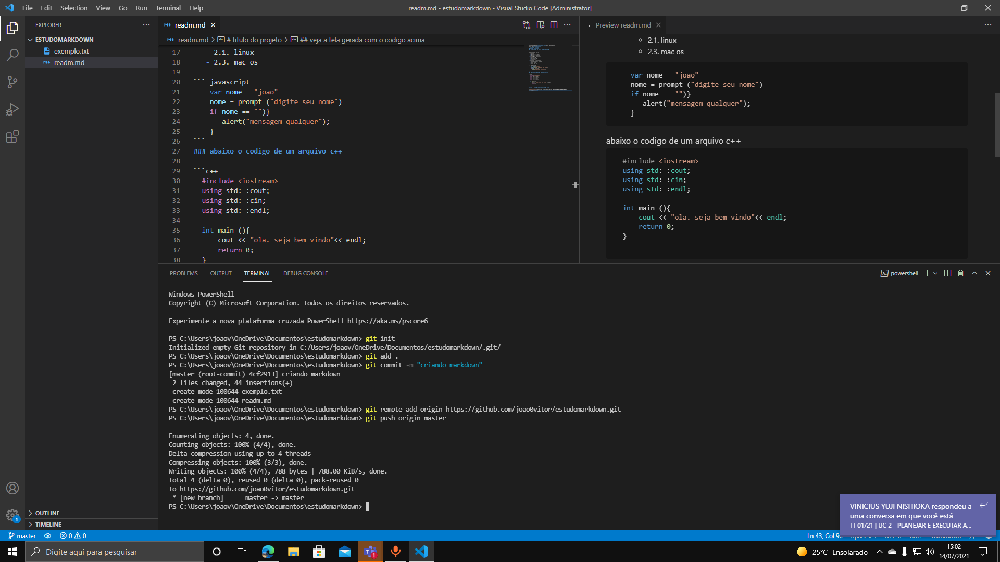

# nosso projeto com documentação


[](http:www.instagram.com.br)

Escrevendo minha **documentação** para _estudar_ um
pouco de ***markdown***
# titulo do projeto
## estudo do projeto
### trabalhando um pouco de documentação

NOVA CAIXA DE TEXTO
* primeiro
   * primeiro.primeiro
   * primeiro.segundo
1. linguagens de script
   * javascript
   * actionscript
   * VBSscript
2. SISTEMAS OPERACIONAIS
   - 2.1 microsoft windows
   - 2.1. linux
   - 2.3. mac os

``` javascript
    var nome = "joao"
    nome = prompt ("digite seu nome")
    if nome == "")}
       alert("mensagem qualquer");
    }
```
### abaixo o codigo de um arquivo c++

```c++
  #include <iostream>
  using std: :cout;
  using std: :cin;
  using std: :endl;

  int main (){
      cout << "ola. seja bem vindo"<< endl;
      return 0;
  }
 
 ```
## veja a tela gerada com o codigo acima


## veja o resultado do estudo markdown


### tarefas

- [x] montar o computador
- [x] formatar o computador
- [x] preparar o pen drive de boot
- [] instalar o sistema operacional no computador
- [] verificar a instalação de drivers

### sistemas e empresas

empresas | sistemas | versao
---------|----------|-------
microsoft|windows   | 11
apple| macOS| 10.14
unbuntu|focal| 2004
Redhat|Enterprise| 8

### application and data
 (aplicação de dados)

 Jquery|python|NodeJS|React
 ------|------|------|-----
 |||
 Java|MySql|postgreSQL|MongoDB
 |||